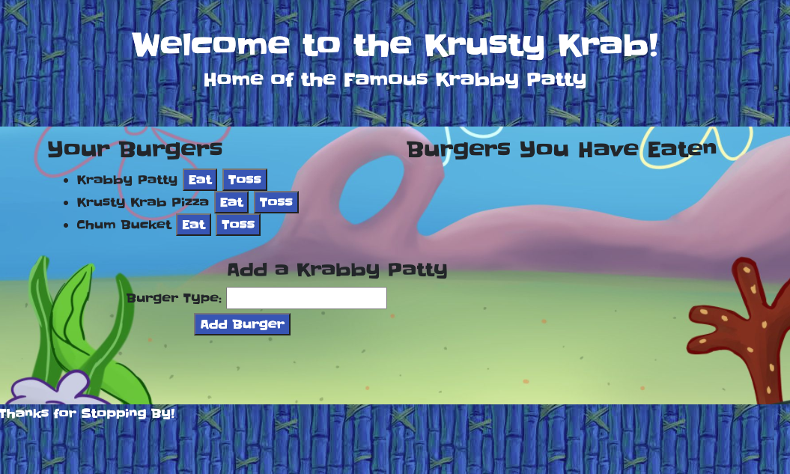
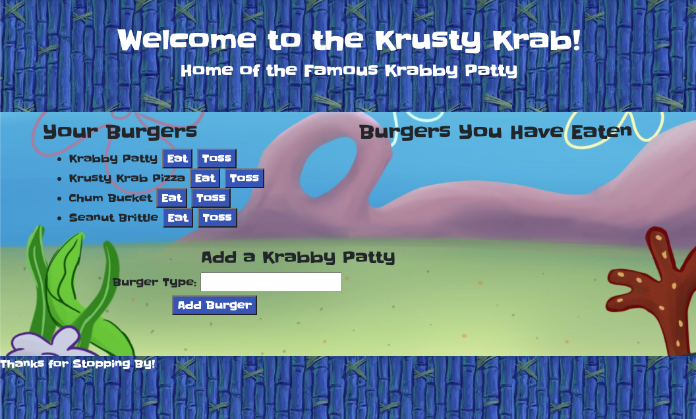
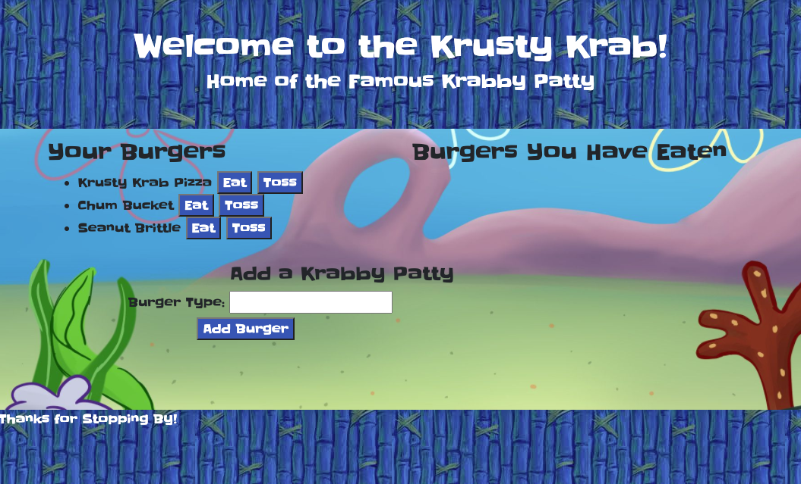

# Krabby Burgers

## About:
File structure and security are becoming more and more important as technology advances. Due to the cooperative nature of modern coding, it is important to have a consistent approach to file structure. This importance of this structure is only emphasized more by the threat of malicious users and software. It is a coders responsibility to maintain a schema by which others can easily approach and abide. 

This Krabby Burger app was made as a representation of the MVC model of database and front end structuring. The view folder was created to keep all front end representation consolidated, and visible for the user with the public folder. The rest of the structure, however, is hidden. Thus improving security. The config folder contains the connection, which utilized .env to keep passwords hidden. That was separated from multiple Javascript files performing back and front end request and responses in order to perfrom CRUD operations, which included multiple security measures. 

By utilizing the MVC format, I was able to create an online app that was not only able to utilize online databasing techniques, but also in a secure and coherent way. This only optimizes the window for future use and editing.

## Index
1) [About](#About)
1) [Installation](#Installation)
2) [Usage](#Usage)
3) [Contributors](#Contributors)
4) [GitHub](#GitHub)
5) [Screenshots](#Screenshots)

## Installation:
In order to install all dependencies, navigate to the root folder, and enter "npm install" into your terminal.

## Usage:
[Link to Deployed Site](https://afternoon-oasis-22216.herokuapp.com)

[Link to Portfolio](https://akleiner26.github.io/Responsiveness-Portfolio/)

## Contributors:
Andrew Kleiner

## GitHub Username:
akleiner26

## GitHub Repo:
https://github.com/akleiner26

## GitHub Photo:
 

## GitHub Email:
AndrewJKleiner@gmail.com

## Screenshots

### Entering Site

### Add Food

### Eating Food

### Deleting Food
